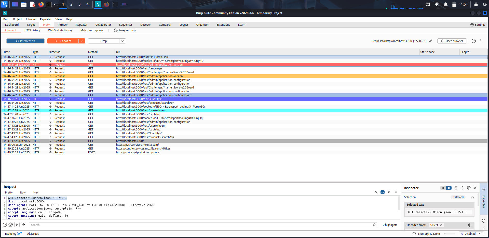

# 🧠 Day 2 – Burp Suite Setup + Intro to XSS

## ✅ What I Did Today

Today I explored the **basics of Burp Suite** and gained foundational knowledge about **Cross-Site Scripting (XSS)** vulnerabilities. While I haven't mastered XSS yet, I now understand how these attacks are crafted and how Burp Suite plays a major role in intercepting and manipulating web traffic.

---

## 🔧 Activities Performed

- Installed and configured **Burp Suite Community Edition**
- Set up **interception** for traffic between my browser and **OWASP Juice Shop**
- Observed request/response behavior in Burp’s **HTTP history**
- Navigated through Juice Shop while inspecting GET and POST requests
- Began experimenting with simple **XSS payloads** like:
  ```html
  <script>alert(1)</script>
  ```
  in various search and input fields


## 🛠️ Tools Used
|Tool|	Purpose|
|------|-------|
|Burp Suite	|Intercept and inspect HTTP traffic
|Juice Shop|	Vulnerable web app for XSS testing
|Firefox|	Configured to route traffic through Burp

### 📚 Key Takeaways
- Burp Suite is an essential tool for intercepting, modifying, and replaying HTTP requests.<br>
- Understanding how web applications reflect and sanitize input is key to exploiting XSS.<br>
- Even when a payload doesn’t trigger an alert, it doesn’t mean the input is safe — deeper testing is needed.<br>
- Getting comfortable with Burp is a **critical step in progressing** toward real-world bug hunting.<br>

### 📷 Screenshots
`Burp Suite Intercepting Juice Shop Traffic`
[](images/day02-burp-interception.png)


##  🧱 Struggles & Errors Faced


### 😵‍💫 1. Feeling Completely Lost at First

- ❌ **Struggle:** The moment I launched Burp Suite, I was hit with **confusion and decision fatigue** — so many tabs (Proxy, Repeater, Decoder...) and no clear direction.
- 🧠 **Mental Block:** I genuinely felt **exhausted, overwhelmed, and frustrated**. It took me a while to even understand what "interception" meant in action.
- ✅ **Breakthrough:** Instead of forcing everything at once, I slowed down and focused on **just getting Burp to intercept traffic**, one step at a time.

> 🔁 **Lesson:** It’s okay to feel stuck — breaking things into smaller, achievable goals makes learning much more manageable.

---

### 🔌 2. Interception Not Working — Proxy Misconfiguration

- ❌ **Issue:** Burp Suite wasn't capturing any HTTP requests from my browser.
- 🔍 **Cause:** I forgot to configure Firefox to use Burp’s proxy at `127.0.0.1:8080`.
- ✅ **Fix:** Set the manual proxy settings in Firefox → Intercept worked perfectly.

> 🔁 **Lesson:** Don’t forget to check basic networking setup like browser proxy configuration — it’s always the small things.

---

### 🦊 3. Firefox Blocked Localhost Proxying

- ❌ **Hidden Problem:** Even after setting the proxy, Firefox was silently **blocking traffic to localhost** through Burp.
- 🧩 **Fix:**
  1. In Firefox, go to the address bar and type: `about:config`
  2. Search for: `network.proxy.allow_hijacking_localhost`
  3. Set it to: `true`

✅ Once changed, **localhost traffic started flowing through Burp Suite correctly**.

> 🔁 **Lesson:** Some security settings in modern browsers prevent localhost proxying — but they can be adjusted when working in a controlled lab environment.

---

### 🧪 4. XSS Payloads Not Working

- ❌ **Struggle:** I tried `<script>alert(1)</script>` in several fields but saw no popup or feedback.
- 😖 **Initial Reaction:** I thought my technique was wrong or Juice Shop was broken.
- 🔍 **Reality:** Some fields had input sanitization, or my payload wasn’t being reflected in the response.
- ✅ **Fix:** I started analyzing request/response pairs using Burp and experimenting with variations in payloads and injection points.

> 🔁 **Lesson:** Successful XSS depends on both reflection and context — testing isn’t always straightforward and may require trial-and-error.

