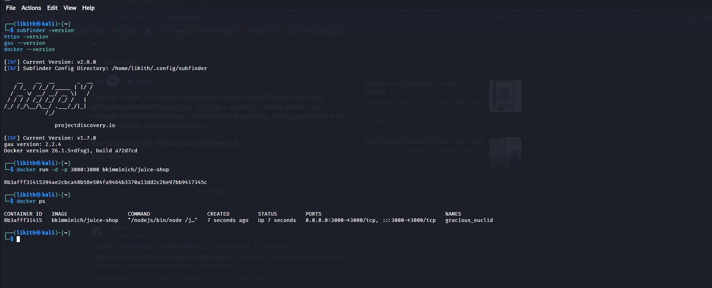
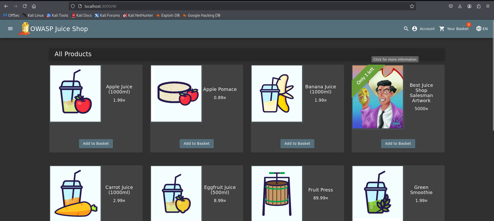

# 🧃 Day 1 – Recon Basics + Juice Shop Setup

## ✅ What I Did Today

### 🔹 Installed and Used Recon Tools
- Installed:
  - [`subfinder`](https://github.com/projectdiscovery/subfinder)
  - [`httpx`](https://github.com/projectdiscovery/httpx)
  - [`gau`](https://github.com/lc/gau)
- Practiced recon on a real program:
  ```bash
  subfinder -d github.com -o subs.txt
  httpx -l subs.txt -o live.txt
  gau github.com > urls.txt
### 🔹 Set Up Juice Shop Lab
Installed OWASP Juice Shop using Docker:

```bash
docker run -d -p 3000:3000 bkimminich/juice-shop
```
- Accessed it at `http://localhost:3000`
- Explored the UI and checked out the Score Board
## 🛠️ Tools Used Today
| Tool |	Purpose|
|------|------------|
|subfinder|	Subdomain enumeration|
|httpx	|Check which subdomains are alive|
|gau	|Discover archived endpoints|
|Docker|	To host Juice Shop lab locally|
## 💡 Key Takeaways
- Recon is the first and most important step in bug hunting
- Subdomain discovery and probing are passive and safe to try on public bounty programs
- `Juice Shop is a fully featured real-world vulnerable web app — perfect for daily practice

## 📷 Screenshots
`Installed Tools and Docker Versions`
[](images/day01-tools-version.png)
`Juice Shop site`
[](images/day01-juice-shop-running.png)
